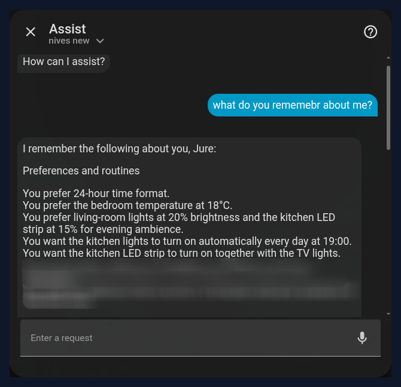
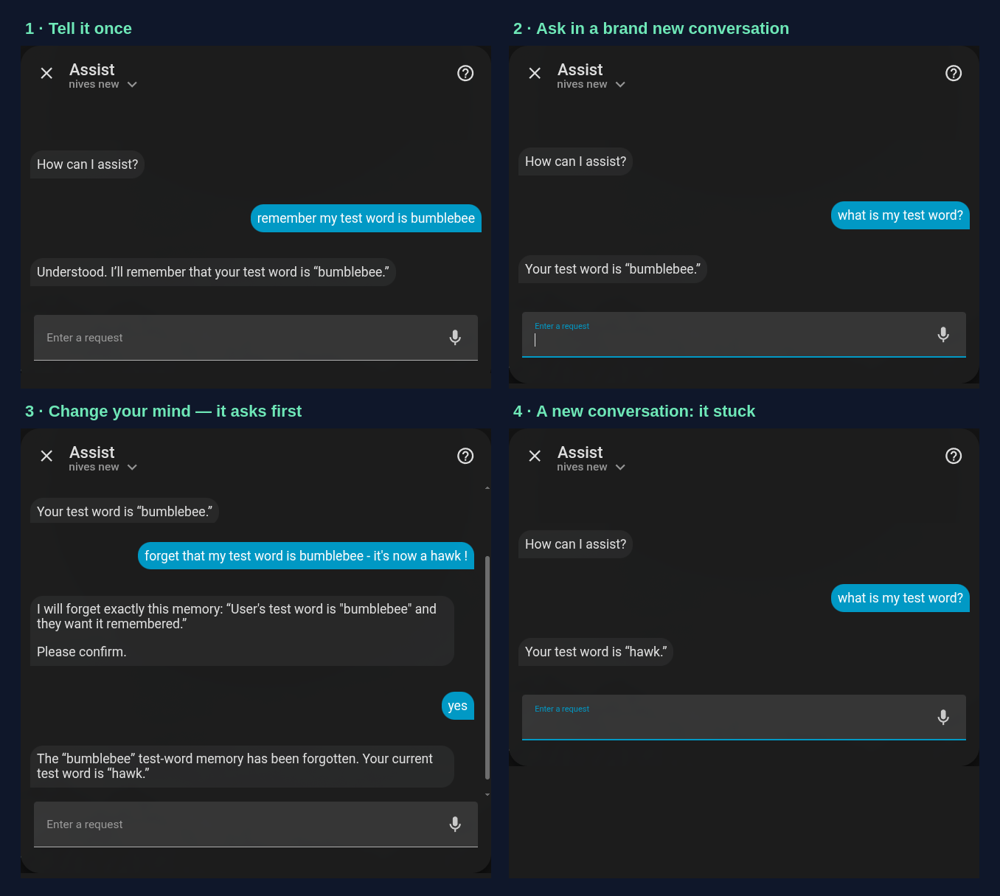
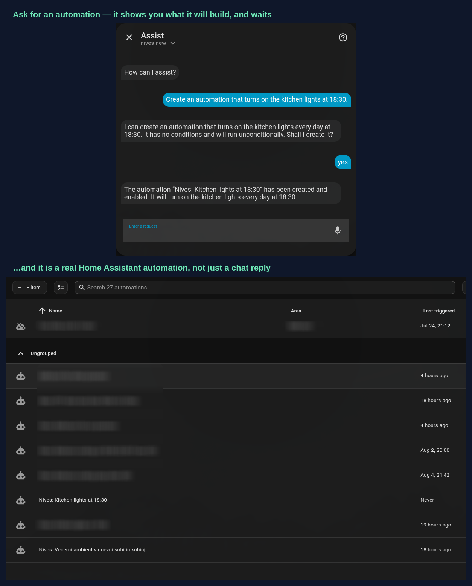
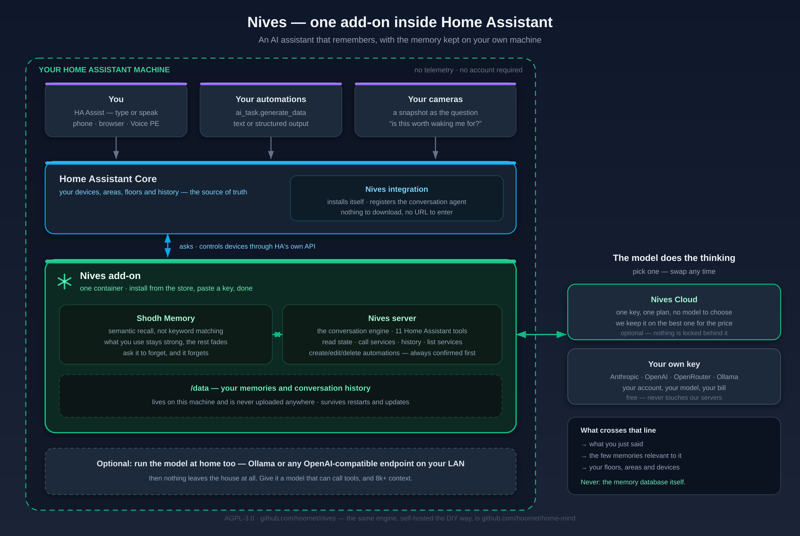

  

  
  
  

<em>An AI assistant for Home Assistant that remembers — one add-on, memory kept on your own machine.</em>

  

Talk to your home in plain language — by voice or text through HA Assist — and Nives recalls your preferences, routines, device nicknames, and sensor baselines across every conversation. No re-teaching, no re-explaining.

> Tell it once — *"100 ppm is normal for my NOx sensor"*, *"bedroom lights should go to 30% in the evening"*, *"call the WLED strip 'main kitchen light'"* — and it remembers next time.

## What you get

- **Persistent memory** — preferences, routines, sensor baselines, device nicknames. Survives restarts.
- **Forgets when you ask it to** — *"forget that my canary word is bumblebee"*. It quotes the exact memory back and waits for your yes before deleting anything.
- **Natural voice & text control** through Home Assistant Assist.
- **Knows your home** — reads your floors, areas, and device capabilities, so it always knows which room a light is in and how to control it.
- **Creates & manages automations** — just ask ("turn the porch light on at sunset", "make the evening scene 30 minutes earlier") and Nives builds, edits, lists, or removes Home Assistant automations for you — always confirming before it changes anything, and using what it remembers about your home (your "evening", your preferred brightness).
- **Works inside your automations** — Nives is also a Home Assistant **AI Task** provider: call `ai_task.generate_data` from any automation to get an answer or structured data, reasoned with your home's context. It can even look at a **camera snapshot** and tell you what matters (with a vision-capable model) — great for smarter, low-false-alarm camera and doorbell alerts.
- **Your memories are stored on your machine** — the memory database lives on your Home Assistant box, not ours, and there's no telemetry. (To answer you, Nives does send the *relevant* memories plus your home layout to the model with each request — the add-on docs spell out exactly what goes where. Want none of it to leave the house? Run a local model via Ollama.)
- **Two ways to power it** — managed **Nives Cloud** (recommended) or **bring your own key**. Both run the exact same on-device server and memory; only the AI endpoint differs.

## Teach it, then change your mind

Four separate conversations, in order. Nothing carries over between them except memory:

It quotes the exact stored memory back and does nothing until you confirm. It only ever forgets the one you name — *"don't forget to water the plants"* is still a reminder, not a deletion — and when several memories could match, it lists them and deletes nothing.

## Automations, described in a sentence

Notice what it tells you *before* building anything: this automation has no conditions, so it will run regardless of who is home. Nothing is written to your Home Assistant, and no memory is deleted, until you say yes — the confirmation is enforced by the server, not left to the model's good manners.

## How it fits together

Everything that stores anything runs on your Home Assistant machine, in one container. The only thing that leaves is the request itself: what you said, the handful of memories relevant to it, and your home's layout. Your memory database never goes anywhere — and if you point Nives at Ollama on your own LAN, nothing leaves at all.

Two services share that container:

- **Nives server** — the conversation engine. Connects to Home Assistant automatically (no URL or token to configure) and controls your devices through HA's own tools.
- **Shodh Memory** — on-device cognitive memory with semantic search, so Nives surfaces the right context at the right moment. ([Shodh Memory](https://github.com/varun29ankuS/shodh-memory) is an independent open-source project — Nives integrates it, and the same engine powers home-mind.)

## Choosing how to power Nives

Nives needs a language model to do the thinking. You have two options — pick one in the add-on's **Configuration** tab.

### Nives Cloud — the easy, recommended path

The no-fuss option, and the best choice for most people — especially if you're new to this, or you'd simply rather not spend your evenings benchmarking models and tweaking settings.

With Nives Cloud you **never choose, test, or babysit a model.** Behind the scenes we run **the best model for the job, always current** — we keep testing the field, and when a better one comes along (or ours gets retired) we swap it on our side. Your assistant just keeps getting better, with nothing for you to install or change.

**How it works:**

1. Sign up at **[nives.house](https://nives.house)** — one plan, everything included.
2. Copy the key it gives you.
3. Paste it into the add-on's **Cloud** section and save.

That's it — no AI provider accounts to manage, no model names to research, no surprise bills (a monthly usage allowance is included). See **[nives.house](https://nives.house)** for current pricing.

### Bring Your Own Key (BYOK) — for tinkerers

Prefer full control? Run Nives with **your own** provider key — Anthropic, OpenAI, OpenRouter, or a local Ollama endpoint — and pick your own model. No subscription.

A few honest notes so it goes smoothly:

- Your model **must support function / tool calling** — that's how Nives actually controls your home.
- Memory quality scales with the model: stronger models extract and recall facts more reliably.
- **Running it locally?** Give it room and a capable model. The system prompt plus tool definitions come to roughly 6,700 tokens before you've said a word, so a default 4k context window is already full — use 8k or more. And small models tend to *narrate* tool calls rather than make them: we've watched llama3.1:8b cheerfully report turning on a light it never touched. Around 14B is where it starts behaving.
- For a fully self-hosted, local-first setup, the open-source **[home-mind](https://github.com/hoornet/home-mind)** project (which Nives grew from) is purpose-built for exactly that.

## Install

You need Home Assistant OS or Supervised (the add-on store), on amd64 or aarch64 — a Raspberry Pi 4/5 is fine. Running HA in bare Docker or Core, with no add-on store? Use [home-mind](https://github.com/hoornet/home-mind) instead; it's the same engine in Docker Compose form.

1. In Home Assistant, open **Settings → Add-ons → Add-on Store**.
2. Click the **⋮** menu (top-right) → **Repositories**.
3. Add this URL: `https://github.com/hoornet/nives`
4. Find **Nives** in the store and click **Install**.
5. Open the **Configuration** tab, choose **Cloud** or **BYOK** (see above), enter your key, and **Save**.
6. **Start** the add-on.

Then point Home Assistant at it: **Settings → Voice assistants → (your assistant) → Conversation agent → Nives**. Now just talk to your home — type in Assist, or speak if you've set up a voice pipeline.

## Nives or home-mind?

People regularly ask how Nives relates to **[home-mind](https://github.com/hoornet/home-mind)** — reasonable, since both come from the same author. Short version: **it's the same brain in a different box, and Nives has grown extra tools.**

Nives started as a fork of the home-mind server, so the core — the conversation engine and the memory layer — is shared heritage. Since then they've deliberately become two independent products aimed at two kinds of people:

- **home-mind** is the DIY path: Docker Compose, run the server and [Shodh Memory](https://github.com/varun29ankuS/shodh-memory) yourself, install the integration, wire it together. Full control, every choice yours, completely hands-on.
- **Nives** is the same stack as **one Home Assistant add-on**: one container, the companion integration installs itself, Supervisor auto-discovers it. Add repo → install → paste a key → done. In most cases you never need a terminal.

What has actually diverged:

| | home-mind | Nives |
|---|---|---|
| **Install** | Docker Compose + manual integration setup | One HA add-on, self-configuring |
| **HA tools** | 6 (read state, list/search entities, call services, history, forget a memory) | 11 — those plus automation **create/list/update/delete** and service discovery, behind a server-enforced confirmation gate |
| **AI Task** | — | `ai_task.generate_data` (text + structured output), usable inside your automations |
| **Vision** | — | camera snapshots as input — "is this expected?" on a doorbell frame |
| **Voice satellites** | — | reopens the mic when it asks you a question (Voice PE `continue_conversation`) |
| **arm64 / Raspberry Pi** | official Shodh Docker image is amd64-only | add-on ships arm64 binaries — works on a Pi / arm64 HAOS out of the box |
| **Models** | BYOK: Anthropic / OpenAI / OpenRouter / Ollama | same BYOK, plus optional managed [Nives Cloud](https://nives.house) |

Both are AGPL-3.0 with open repos, and both are maintained. There are **no features locked behind the Nives subscription** — Cloud exists purely as the less-tinkering option, and the BYOK path is free and never touches our servers. If you enjoy owning every moving part, home-mind is built for you; if you'd rather it just work, that's Nives.

## Coming from HomeMind PRO?

Nives is the same add-on under a new name, since v2.0.0 — same memory layer, same Cloud and BYOK modes, same behaviour. The name is Slovenian, from the Latin *nives*, "snows"; it's pronounced **NEE-ves**, and it's a good deal easier to say to a voice assistant than an acronym.

Switching over is a clean install rather than an update, because the add-on's underlying slug changed:

1. Install **Nives** from the same repository — it appears alongside your existing HomeMind PRO rather than replacing it.
2. Copy your configuration across (your key and any options).
3. Start Nives, check it answers, then uninstall HomeMind PRO.

Memories and conversation history don't carry over, so Nives starts fresh and learns you again. Your account and Cloud subscription are unaffected — they simply live at [nives.house](https://nives.house) now, and old `homemindpro.com` links redirect there.

The [v2.0.0 changelog](nives/CHANGELOG.md) has the full detail.

## Related projects

- **[home-mind](https://github.com/hoornet/home-mind)** — the open-source server Nives grew from (AGPL-3.0). An independent project; run it yourself if you prefer the fully-DIY path.
- **[Shodh Memory](https://github.com/varun29ankuS/shodh-memory)** — the cognitive memory engine powering both, by [@varun29ankuS](https://github.com/varun29ankuS). We integrate it, we didn't write it — and neither project would exist without it.
- **[nives.house](https://nives.house)** — the optional Nives Cloud service.

## Support & feedback

Nives is in early access and we'd genuinely love to hear from you.

- **Bugs / feature ideas:** open an [issue](https://github.com/hoornet/nives/issues).
- **Cloud or subscription questions:** [nives.house](https://nives.house) or hello@nives.house.

## License

Nives — Home Assistant add-on bundling a conversation server (a hard fork of [home-mind](https://github.com/hoornet/home-mind)) and Shodh Memory.
Copyright (c) 2026 Jure Sršen.

AGPL-3.0 — see [LICENSE](LICENSE).
